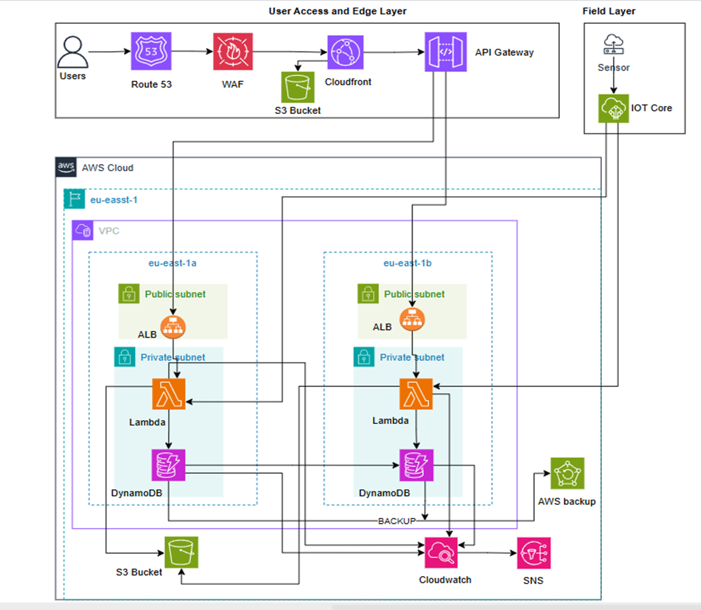

# AWS-smart-agriculture-System
A serverless AWS solution for monitoring soil and crop health
# Smart Agriculture System (AWS Cloud Native)

## ☁️ Architecture

*A three-tier serverless architecture designed for high availability and predictive agriculture.*

## 🎯 Project Overview
This project addresses the technology gap in traditional farming by providing real-time sensor data processing and automated alerting. It transforms reactive farming into a data-driven practice, optimizing water and resource usage.

## 🏛️ Well-Architected Alignment
- **Security:** Implemented **VPC with Private Subnets** to isolate compute resources. Leveraged **AWS WAF** at the edge and enforced **IAM Least-Privilege** for all service interactions.
- **Reliability:** Built across **two Availability Zones (Multi-AZ)** to ensure 99.9% uptime and used **AWS Backup** for disaster recovery.
- **Cost Optimization:** Conducted a **FinOps analysis** showing a production cost of ~$163.74/month, utilizing the **AWS Free Tier** for Lambda and DynamoDB.
- **Performance Efficiency:** Used **Serverless architecture** (Lambda/IoT Core) to handle up to 10,000 concurrent users without manual intervention.

## 🛠️ Tech Stack
- **Compute:** AWS Lambda (Python)
- **Database:** Amazon DynamoDB (NoSQL)
- **Ingestion:** AWS IoT Core & API Gateway
- **Security:** AWS WAF, IAM, VPC
- **Monitoring:** Amazon CloudWatch & SNS Notifications
