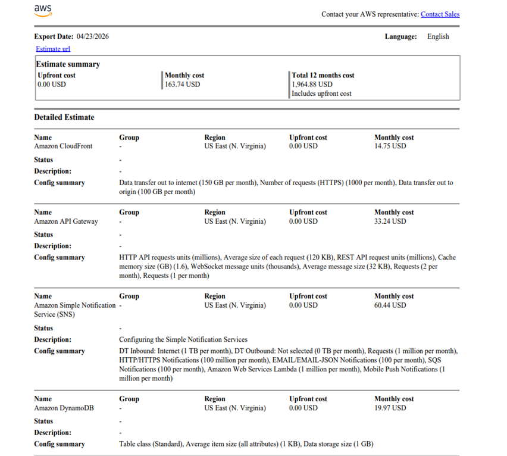

# 💰 Cost Optimization (FinOps)

This project ensures the architecture remains cost-effective while meeting high-availability requirements.

- **Monthly Running Cost:** $163.74  
- **Architecture Strategy:** Utilized a Pay-As-You-Go serverless model to eliminate idle costs.

### Cost Analysis Evidence

